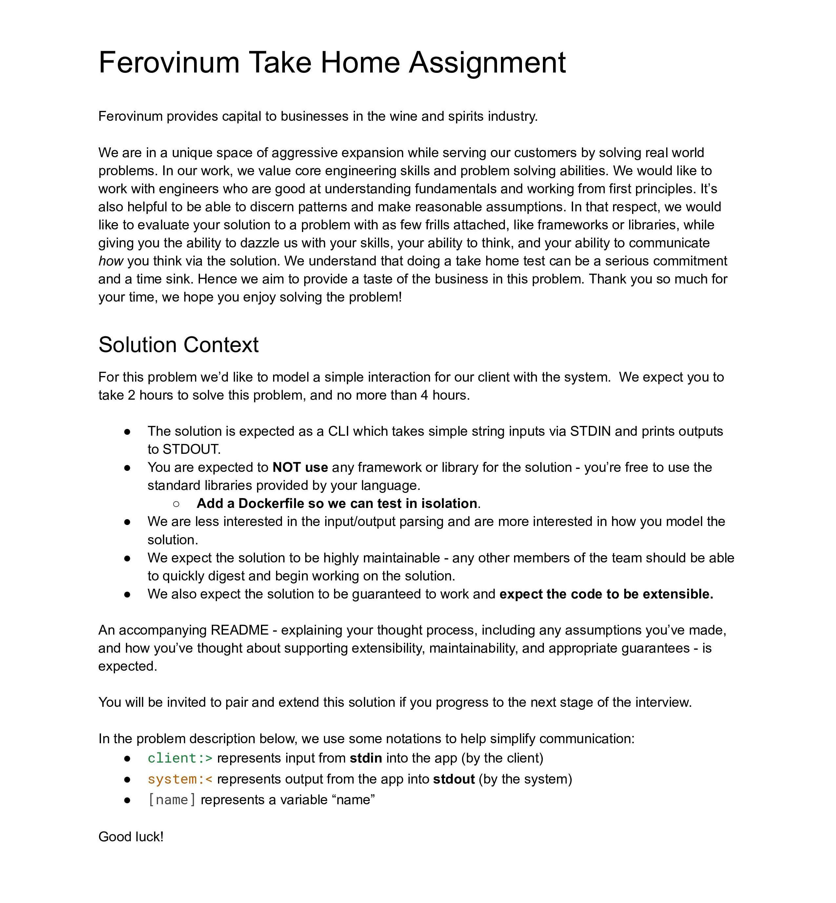
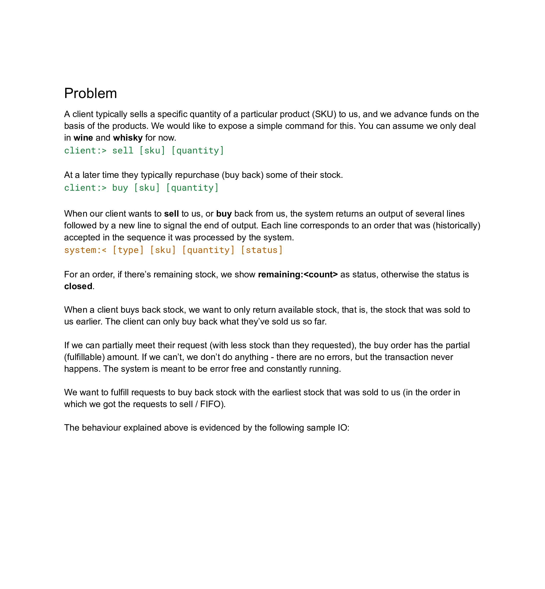
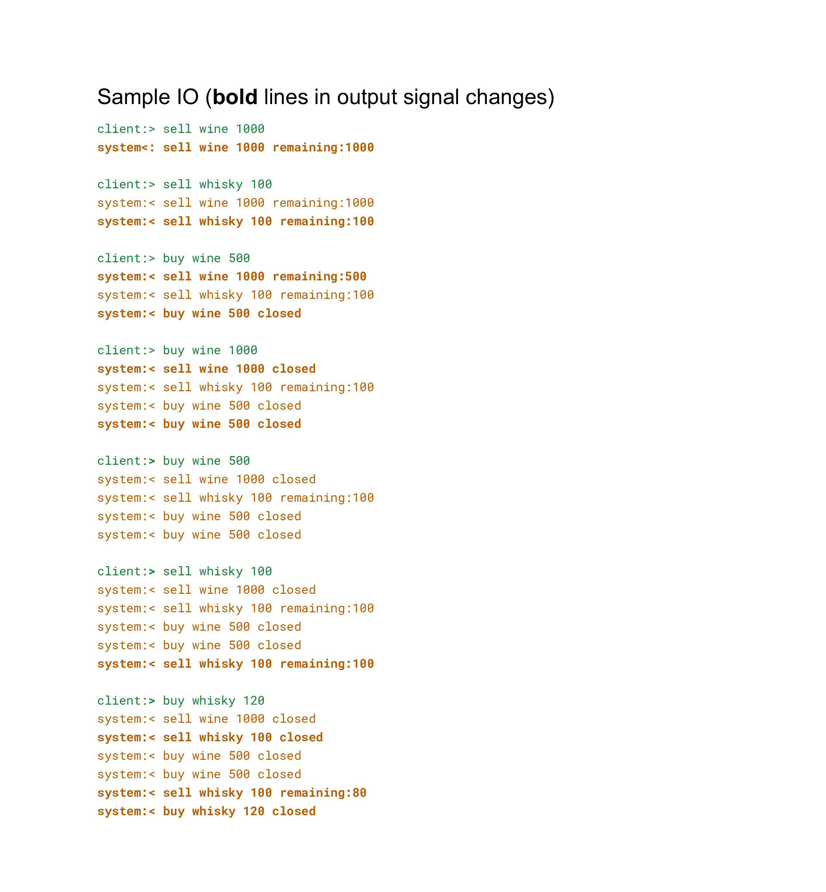

## Contents
* [Tech Stack](#tech-stack)
* [Assignment Description](#assignment-description)
* [How To Run](#how-to-run)
* [Testing](#testing)
* [Assumptions](#assumptions)
* [Thought Process](#thought-process)
* [Comments](#comments)

### Tech Stack
- Java 23 (OpenJDK, preview enabled)

### Assignment Description
<details>
<summary>Click to read instructions</summary><br />



</details>

### How To Run
<details>
<summary>Run with Docker</summary><br />
Execute:

```shell
make
```
</details>

<details>
<summary>Run with Maven</summary><br />
Execute:

```shell
make mvn-run
```
</details>

### Testing
All tests can be found under the `src/test/` directory.  
Run the tests by executing:

```shell
make test
```

### Assumptions
- Single-threaded environment, the ledger is only accessed by one thread
- The user never makes mistakes with their input entry i.e. I haven't spent time writing code to validate and clean the user input in order to focus on modeling my solution

### Thought Process
I mainly focused on keeping the solution as succinct and as clear as possible. I wanted it to be easy to understand so that anyone would be able to jump in and work on it as quickly as possible.  

### Comments
- I've used the term `Ledger` in this project to stand for the list of transactions that happen in the system, although I'm not completely happy with this naming.<br />When you think of a ledger (e.g. an accountant's ledger) it's usually a list of immutable transactions that have occurred, that's why it's often used as an example when explaining event-sourced systems, whereas here, the ledger is mutable and the entries change state over time.<br />However, it was a terse and straightforward term to use.
- I've used a CSV parsing library in the tests to read from a file and cut down on boilerplate
- I've used the Lombok annotation library, again to cut down on boilerplate code (getters, setters etc.)
- As mentioned in the assumptions section, I assume properly formatted user input, so I haven't included test cases for scenarios I know will fail (e.g. to test handling of malformed user input) 
